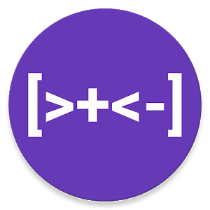

# Go-BrainFuck


### The first golang brainfuck interpreter that actually works

## How to compile

##### You must have make installed in order to execute this command

```
make build
```

This will build the binaries inside the `bin/` folder

## How to install

##### Using the go cli utilities

```
go install
```

This will compile and install the binary in the bin golangroot folder

## Program usage

This is the syntax the program must be run with:

```
./go-brainfuck <arguments> <file>
```

Example usage:

```
./go-brainfuck -o examples/fibonacci.bf
```

## Program arguments

- `-h` Prints out a handy short documentation of the program arguments
- `-o` Enables optimization mode, depending on the nature of your program it may make it run faster or slower. It compresses long operational chains (++++++ or ------) into shorter versions that can decrease run time up to 7 times!
- `-d` Enables debugging characters (see [Debug characters](##debug-characters))
- `-v` Visualizes the memory after each instruction (good for math related debugging, fills up the output)
- `-t time` Waits t time after each instruction (format: "10s", "20ms", "1m", "10y")

## Debug characters

Apart from the standard brainfuck characters, you can also use the debug characters by enabling the option in the arguments (see [Program arguments](##Program-Arguments))

Here's the list of the available debugging characters that you can use:

- `=` Prints out the current pointer byte, the next and the previous
- `#` Prints out the whole memory
